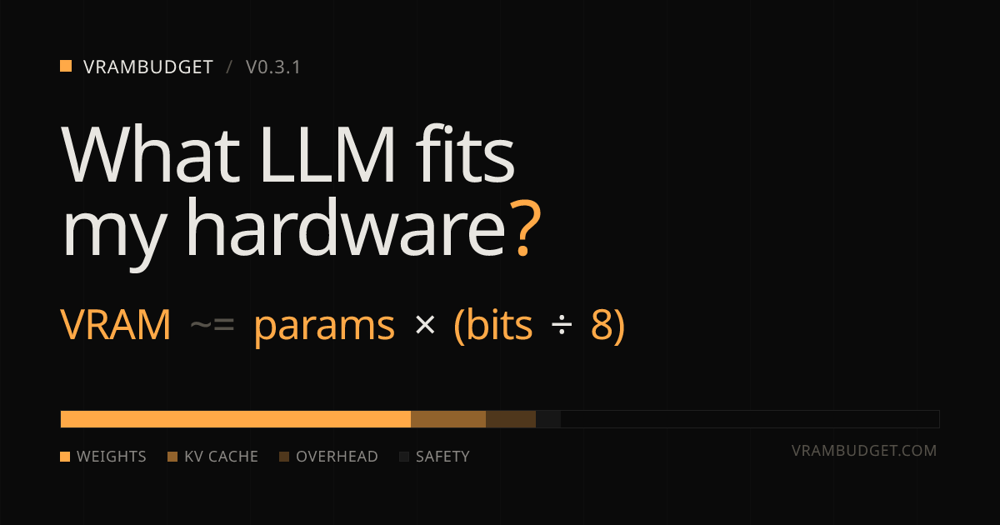

<div align="center">
  
</div>

<br />

<div align="center">

  **What LLM fits my hardware?**

  The math behind local LLM memory budgets. Plug in a GPU and a context length; see what's actually left for weights after the KV cache, runtime overhead, and a safety margin.

  [Live site](https://vrambudget.com) · [Run the calculator](https://vrambudget.com/#calculator) · [Read the math](https://vrambudget.com/the-math)

</div>

<br />

<table align="center">
  <tr>
    <td align="center" width="160">
      <h2><code>40</code></h2>
      <sub>GPU presets</sub>
    </td>
    <td align="center" width="160">
      <h2><code>20</code></h2>
      <sub>curated models</sub>
    </td>
    <td align="center" width="160">
      <h2><code>9</code></h2>
      <sub>quant formats</sub>
    </td>
    <td align="center" width="160">
      <h2><code>64</code></h2>
      <sub>agent-readable routes</sub>
    </td>
    <td align="center" width="160">
      <h2><code>MIT</code></h2>
      <sub>open source</sub>
    </td>
  </tr>
</table>

<br />

## The thesis

Every "can I run this LLM" tool lists models and calls it done. They show a green checkmark next to a 70B on a 24GB card and hope you don't ask why. vrambudget skips the magic. There is one formula and three taxes:

```
VRAM ~= params × (bits ÷ 8)
```

That's the floor. Everything else is overhead.

```
weights_budget = total_vram × (1 − safety)
                 − kv_cache × concurrency
                 − framework_overhead
```

Three subtractions and one multiplication. Anyone telling you it needs to be more complicated is selling you something.

## How to use the calculator

The calculator is on the home page. Five sliders, four tiles, one bar, three tabs.

### 1. Pick a GPU

Across the top of the calculator: eight family tabs (RTX 50, RTX 40, RTX 30, Apple Silicon, Workstation, Datacenter, AMD, Intel). Each tab reveals every card in that family. Click a card to lock the calculator to its stock VRAM.

For a long-form view of every GPU at once, visit [/gpu](https://vrambudget.com/gpu).

### 2. Tune the four sliders

| Slider | What it does |
|---|---|
| **VRAM** | Total memory on the card. Auto-set from your GPU choice; override freely. |
| **System RAM** | Reserved for future model-split workflows. Not currently in the math. |
| **Context** | Token window. 8K is conservative; 32K and 128K make KV cache the dominant tax. |
| **Concurrency** | How many requests serve in parallel. Each one gets its own KV cache. |
| **Safety headroom** | Percentage of VRAM you refuse to spend. 15 percent is a sane default. |

### 3. Read the four tiles

- **Total VRAM** — device capacity
- **KV cache** — what the context-tax costs you
- **Runtime overhead** — CUDA / kernels / allocator slack
- **Weights budget** — what's actually left for the model

The orange tile is the answer. The budget bar below shows the four pieces stacked so you can see where the VRAM went.

### 4. Find a model

Three tabs below the bar:

- **Curated picks** — the 20 catalog models, grouped by fit (fits / tight / over). Each row picks the highest-bit quantization that fits your budget. Click any model name to open its Hugging Face repo.
- **Search Hugging Face** — live search across HF's GGUF-tagged models. Type a name; results render with the same fit classification keyed to your current budget.
- **By size** — drag a params slider; see all nine quants in a 3×3 matrix with the size and fit class for each.

### 5. Drill into a card or a model

Every GPU card in the grid has a `↗` link to its detail page. Each detail page pre-binds the calculator to that card, plus a fit table of the top 12 models, plus four "compare to" cards for stepping up or down by VRAM.

Same for models: every model name links to `/model/<slug>` with the GPU-recommendation matrix across five quants.

## What's in the catalogs

### GPUs (40)

`RTX 50`: 5070 · 5070 Ti · 5080 · 5090
`RTX 40`: 4060 · 4060 Ti 16GB · 4070 · 4070 Super · 4070 Ti Super · 4080 · 4080 Super · 4090
`RTX 30`: 3060 · 3070 · 3080 · 3080 Ti · 3090 · 3090 Ti
`Apple Silicon`: M2 Max 64 · M2 Ultra 192 · M3 Max 64 · M3 Max 96 · M3 Ultra 512 · M4 Pro 64 · M4 Max 128
`Workstation`: A6000 · RTX 6000 Ada · RTX Pro 6000 · L40S
`Datacenter`: H100 80GB · H200 · B200 · DGX Spark · 2× H100 NVL
`AMD`: RX 7900 XTX · W7900 · MI300X
`Intel`: Arc B580 · Arc Pro B60 · Gaudi 3

### Models (20 curated)

`Meta`: Llama 3.1 8B / 70B / 405B
`Alibaba`: Qwen 2.5 7B / 32B / 72B
`Mistral`: Mistral 7B v0.3 · Mixtral 8x7B · Mixtral 8x22B
`Microsoft`: Phi-3 Mini / Medium · WizardLM 2 7B
`Google`: Gemma 2 9B / 27B
`DeepSeek`: DeepSeek Coder 33B · DeepSeek V2.5
`Cohere`: Command R+
`IBM`: Granite 8B Code
`BigCode`: StarCoder2 15B
`01.AI`: Yi 34B

### Quantization formats (9)

`FP16/BF16` · `FP8/INT8` · `Q8_0` · `Q6_K` · `Q5_K_M` · `Q4_K_M` · `Q3_K_M` · `AWQ` · `GPTQ`

## Agent View Layer (AVL)

Every page on vrambudget ships a parallel agent-readable view at `<route>.agent` (e.g. [`/gpu/rtx-4090.agent`](https://vrambudget.com/gpu/rtx-4090.agent)). The view is TOON-encoded and includes `@meta`, `@intent`, `@state`, `@actions`, `@context`, and `@nav` sections per the [AVL L3 conformance spec](https://agentviewlayer.org). The full manifest lives at [/agent.txt](https://vrambudget.com/agent.txt).

Built with [@frontier-infra/avl](https://github.com/frontier-infra/avl).

## Local development

```bash
pnpm install
pnpm dev          # localhost:3000, hot reload
pnpm typecheck    # tsc --noEmit
pnpm build        # static export to out/, plus postbuild AVL emitter
pnpm start        # serve out/ on $PORT (default 3000)
```

`out/` after build contains:

- 64 route HTMLs (home, the-math, /gpu, /model, 40 GPU detail, 20 model detail)
- 64 `.agent` companion files
- `agent.txt`, `sitemap.xml`, `robots.txt`
- 61 OG image PNGs, favicon SVG, apple-touch-icon
- Static assets and font bundles

## Deploy

The project is wired for **Railway** out of the box. `railway.toml` pins Node 22 + pnpm 9 and configures Nixpacks with explicit build/start commands and a `/` healthcheck.

Works on any static host: Cloudflare Pages, Vercel, Netlify, S3+CloudFront, GitHub Pages, plain nginx. Just point at `out/`.

## Stack

- [Next.js 15](https://nextjs.org) (App Router, static export)
- [TypeScript 5](https://www.typescriptlang.org)
- [React 18](https://react.dev)
- [pnpm 9](https://pnpm.io)
- Vanilla CSS · [Geist](https://vercel.com/font) + [JetBrains Mono](https://www.jetbrains.com/lp/mono/)
- [@frontier-infra/avl](https://github.com/frontier-infra/avl) for the parallel agent views
- [Playwright](https://playwright.dev) for end-to-end browser verification

## Roadmap

- **Phase 2: Runtime badges.** Per-model compatibility badges for Ollama, LM Studio, vLLM, and MLX with one-click install commands.
- **Build-time HF enrichment.** Pull download counts, license, and architecture from the HF Hub API at build so curated cards show context beyond what the slug carries.
- **Per-model architecture.** Replace the 13B reference for KV cache with per-model GQA / MQA + head dimensions for tighter estimates.
- **Tokens-per-second.** Bandwidth-based throughput estimates next to the fit pills.
- **Cloud comparison.** This model on your machine vs OpenRouter pricing for the equivalent.

See [issues](https://github.com/webdevtodayjason/vrambudget/issues) for the live list.

## Contributing

Open a PR. Two soft rules:

- **No em dashes** in new copy. Colons, periods, semicolons.
- **Numbers in monospace.** VRAM, params, GB, percentages.

## About the builder

Built by **Jason Brashear**. MSP owner, AI application developer, and 30-year IT veteran out of Texas.

- Personal site: [jasonbrashear.com](https://jasonbrashear.com/)
- Substack: [jasonbrashear.substack.com](https://jasonbrashear.substack.com/)
- Medium: [@jason_81067](https://medium.com/@jason_81067)
- Dev.to: [@webdevtodayjason](https://dev.to/webdevtodayjason)
- X: [@argentAIOS](https://x.com/argentAIOS)
- GitHub: [@webdevtodayjason](https://github.com/webdevtodayjason)

## License

MIT. See [LICENSE](LICENSE). Use it however you want.
